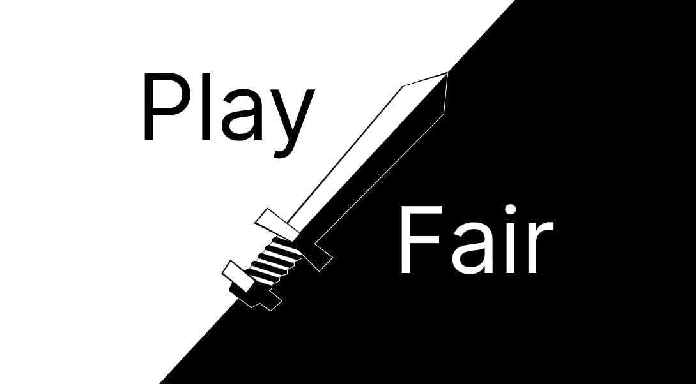

# About <a href="https://nodejs.org/api/n-api.html"></a><a href="https://www.rust-lang.org/"></a>

<p align="center">
  
</p>

# What's this?

Are you a developer who creates Node apps for other people?

Don't you just hate it when the client **refuses to pay** after you finish the project?

## Yes!

**Playfair** is a DRM built for Node.js, designed to be used **against** people who don't play fair.

If someone doesn't pay, you can permanently brick the application via a remote killswitch.

And bypassing Playfair isn't as simple as removing the request to the server.

If you're interested in the black magic it does, [read here](https://github.com/UnexomWid/playfair?tab=readme-ov-file#is-it-uncrackable).

## What if they pay after I added Playfair?

Then **please** remove the Playfair protection (see below). It's very simple to do.

**Nobody likes to see DRM after they paid.**

While Playfair tries to incurr minimal overhead, it may still slow down the startup of the app.

This is not nice for clients who pay!

# Setup

Install [Rust](https://www.rust-lang.org/). You already have [Node](https://nodejs.org/en) installed (if not, Playfair isn't for you).

```sh
git clone https://github.com/UnexomWid/playfair

cd cli

cargo install --path .
```

## Add Playfair protection to a project

Choose a `.js` file, preferrably the most important one in the project.

In your project dir, inside the same dir as the file you chose:

```sh
playfair pack <file.js> <key> <url>
```

Choose the key that you want to encrypt the file with, and also a URL. Playfair will send requests there to obtain the key.

Example:

```sh
playfair pack file.js keyhere https://example.com/here
```

Your file was renamed to `_orig.js`. Place it in `.gitignore` so you don't accidentally push it.

You should also see a `.package` dir. That's where the encrypted file and the Playfair Lib are stored.

Now, host the [server](https://github.com/UnexomWid/playfair/tree/master/server) at that URL you chose.

Note that you need to at least change the key inside `playfair.js`, to make it match the one you chose previously.

All done! For you, the original file will be imported directly. Everyone else will only have the encrypted file, which relies on the server being up.

If you make any changes to the original file, simply do this:

```sh
playfair strip file.js

playfair pack file.js keyhere https://example.com/here
```

This removes and re-adds the Playfair protection.

If the client doesn't pay, simply shut down the server and let them wonder why the app suddenly exists at startup for no reason.

## Remove Playfair

```sh
playfair strip file.js
```

This completely removes the protection, and restores the original file.

Don't forget to commit the original file!

# How does it work?

Playfair employs low-level black magic to ensure that your client will not get away with not paying.

1. you choose a `.js` file inside your project, and a key
2. Playfair encrypts this file with the given key, and renames the original file to something else
3. you add the original file in your `.gitignore`, such that you have the only copy
4. the original file is replaced by a wrapper `.js` file
5. when the Node app starts and the wrapper `.js` file is imported, it checks for the original file
6. if it's not there, it will attempt to decrypt the encrypted file
7. the decryption key is obtained by sending a request to a server (you choose it when you set up playfair)
8. the file is decrypted and imported directly from memory. The original source code is not stored on the disk
9. after the file is imported, everything works as it should.

## Killswitch

If, for any reason, the server refuses to give the key, then it's impossible to decrypt the file.

This is effectively the killswitch that you can use if the client doesn't pay.

# Is it uncrackable?

There is no way to create a DRM which can't be reverse-engineered. With enough effort, it can be done.

The question shouldn't be `Is it uncrackable?`, but instead `How much effort does it take to crack, and is it worth it?`.

Playfair is **good enough**, meaning that your average client, even with the most advanced JavaScript knowledge, stands almost no chance in figuring out what's happening. This is because Playfair relies heavily on machine code, and therefore also requires non-Javascript reverse-engineering skills.

There are 2 scenarios under which someone can try to crack Playfair:

1. **before** the killswitch is activated
  - this is technically possible, but requires the client to suspect that a DRM is being used, and they must have knowledge of how Playfair works
2. **after** the killswitch is activated
  - at this point, it's pretty much impossible to do anything; the file is encrypted and they don't know the key

Let's see what Playfair does:

## Playfair Protection

### Machine Code

Playfair is implemented in Rust, which is compiled to **machine code**. It uses N-API in order to communicate with Node, and has a simple `.js` wrapper file which loads it.

This makes it considerably harder to reverse-engineer, especially considering that your clients are probably either normal people, or JavaScript developers at best.

If someone has the required skills to dismantle Playfair (or any MZPE executable for that matter), they have better things to do and aren't the type of people to go around scamming developers for free Node apps.

### String Obfuscation

Strings are obfuscated, such that static scanners can't automatically fish for important strings (such as the URL where the request is being sent).

This also makes it harder for someone who peeks into the MZPE executable to find relevant strings easily.

### Military-grade Encryption

Playfair does not rely on "Security through Obscurity" when it comes to encryption.

Files are encrypted via AES-256 in CBC mode along with PKCS7.

For key derivation, Playfair uses Argon2id which is the **de facto** standard for password hashing.

Absolutely no compromises here.

This ensures that there is no way to recover the original file after the killswitch is activated, unless you have the key.

### Memory Operations

After decryption, the original file **DOES NOT** touch the disk. It's only stored in memory for the purposes of being imported by Node.

Playfair goes to great lengths in order to make Node directly import code from memory, because storing original code on the disk is an exploitable weakness.

### Integrity Check

Playfair **refuses** to load if its wrapper file has been modified in any way. This ensures that someone can't just change the playfair wrapper and `console.log` the
code of the original unencrypted file when it is imported.

Though there is a workaround, it involves creating other files and importing the Playfair module directly from there, bypassing the wrapper.

The integrity check is only there to deter people from easily being able to modify the wrapper itself.

Similarly, Playfair also won't be able to load the encrypted file if it has been modified in any way, since those modifications will corrupt the data.

### Server Identification

Playfair doesn't blindly trust the server from which it gets the decryption key, since someone could create their own server to mimic the behavior.

When the server sends the key, it must also send a HMAC hash which is verified by Playfair. The HMAC secret is only known by the original server and by Playfair.

There is no way to obtain the same hash from the same input, unless you have the same secret.

### Client Identification

The server also doesn't blindly trust anyone who sends requests to it. It checks multiple headers in order to make sure the request **most likely** came from Playfair.

It also doesn't send the key in plaintext. Rather, it enciphers it with a key given by the client, which is generated randomly.

If someone manages to replicate the Playfair requests and gets the key from the server, they still need to go through Playfair itself in order to decrypt the file due to the key derivation that has to be done before decryption.

# Limitations

Playfair only works with files which use ES6 modules, and only with files which have a default export. Named exports won't work.

Also, imports from `node_modules` don't work currently. Only relative and built-in modules do. This will be fixed soon.

Both of those are limitations of the in-memory ES6 import mechanism, which is used in order to make sure the original code is never stored on the disk.

# Modifying Playfair

The project contains 4 components:
- **core**: this is the core of Playfair; it's shared among all components
- **cli**: this is the CLI tool; you use it to protect/unprotect projects with Playfair
- **lib**: this is the Node module which is actually imported; it does most of the magic
- **server**: this is the playfair server; the lib sends requests to it

If you make changes to the Playfair Lib, Core or CLI, you can re-build like this:

```sh
cd lib

npm run xbuild

cd ..
cd cli

cargo install --path .
```

Note that you should compile on Windows, Linux and Mac, which may require compiling on different machines.

If you only run `xbuild` on Windows and it can't generate the binaries for other platforms, you won't be able to run apps protected by Playfair on those platforms.

The CLI has to be compiled locally on the machine where you want to use it. This is because the CLI binary stores the local path to the compiled Lib (which is in `_dist`). When you add Playfair to a project, the Lib binary needs to be copied from there (so the CLI has to remember the dir path).

# License <a href="https://github.com/UnexomWid/playfair/blob/master/LICENSE"></a>

**Playfair** was created by [UnexomWid](https://uw.exom.dev). It is licensed under [MIT](https://github.com/UnexomWid/playfair/blob/master/LICENSE-MIT) OR [Apache 2](https://github.com/UnexomWid/playfair/blob/master/LICENSE-APACHE).